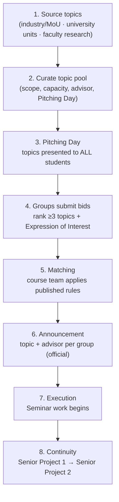

# Seminar Topic Selection — Standard Operating Procedure (SOP)

**Software Engineering Seminar** · Bachelor of Engineering in Software Engineering (Curriculum 2569)
School of Applied Digital Technology · Mae Fah Luang University

> **Shared document.** This SOP appears in **both** the *SE Student Handbook* and the *Faculty Advisor Handbook*. It is the single source of truth for how Seminar topics are sourced, pitched, chosen, and matched — and how that work carries forward into **Senior Project 1 → Senior Project 2**.

| Item | Detail |
|------|--------|
| Course | Seminar in Software Engineering |
| Course code | `1305392` (Curriculum 2564) |
| Applies to | Year 3 students on Curriculum 2564 (cohorts 2566–2568), entering the Senior Project track |
| Selection unit | **Group** (up to 4 members) |
| Owner | Seminar course team / Programme coordinator |
| Downstream | Senior Project 1 (Y3 S2) → Senior Project 2 (Y4 S1) |
| AUN-QA links | 1.5, 2.5, 3.3, 3.4, 4.3, 8.4 |

---

## 1. Purpose

To make Seminar topic selection **transparent, stakeholder-driven, and continuous** — ensuring every group works on a real, supervised topic that can mature from Seminar into a full Senior Project.

The model is **supply-driven**: topics are sourced by faculty from real demand (industry MoU partners, university units, and faculty research), then offered to students. Students express ranked preferences; the course team matches groups to topics and advisors.

---

## 2. Guiding principles

| Principle | What it means in practice |
|-----------|---------------------------|
| **Real problems first** | Every topic traces to a named **stakeholder** (industry / MoU / university unit / faculty research). No purely hypothetical topics. |
| **Student voice** | Groups rank **at least 3** topics (bidding form allows up to 4) with a written reason ("Expression of Interest"). |
| **Fair matching** | Matching rules and capacity per topic are published *before* students submit. |
| **Continuity** | The chosen topic and advisor stay with the group through Senior Project 1 and 2 wherever possible. |
| **Evidence-ready** | Each stage produces a record (topic sheet, pitch deck, bidding responses, matching decision, announcement) usable as AUN-QA evidence. |

---

## 3. Roles and responsibilities

| Role | Responsibilities |
|------|------------------|
| **Programme coordinator** | Owns the SOP; approves the topic pool; chairs the matching decision; signs the final announcement. |
| **Seminar course team (faculty)** | Sources topics; runs the Pitching Day; publishes topic sheet + capacity + matching rules; performs matching. |
| **Stakeholders** (industry / MoU / university units) | Propose problem statements; define scope and expectations; (optionally) co-mentor. |
| **Prospective advisors** | Offer topics from their research; declare capacity (max groups they can supervise). |
| **Students (groups)** | Form a group (≤4), attend all pitches, submit ranked preferences + reasons by the deadline. |

---

## 4. Process at a glance

---

## 5. Stage-by-stage SOP

### Stage 1 — Source topics
- **Who:** Course team, in coordination with stakeholders and advisors.
- **What:** Collect candidate topics from three channels:
  1. **Industry / MoU partners** — companies with an active MoU or collaboration.
  2. **University units** — internal offices needing a system (e.g. Placement & Cooperative Education).
  3. **Faculty research** — topics that extend an advisor's ongoing research.
- **Output:** Draft list of topics with a named stakeholder for each.

### Stage 2 — Curate the topic pool
- **Who:** Course team + coordinator (approval).
- **What:** For every accepted topic, record the standard fields (see §7 *Topic Sheet*): stakeholder, title, detail, **accepted number of students per group**, assigned/expected advisor, and **Pitching Day slot**.
- **Output:** Published **Topic Sheet** + **matching rules** + submission deadline — released to students *before* Pitching Day.

### Stage 3 — Pitching Day
- **Who:** Course team / stakeholders present; **all students attend**.
- **What:** Each topic is pitched (scope, expected outcome, skills needed). Students take notes and ask questions.
- **Output:** Pitch materials archived (slides/links) as evidence.

### Stage 4 — Group bidding
- **Who:** Students, as groups.
- **What:** Each group submits the **bidding form** (see §7): group name, member IDs/names (≤4), preferred advisor (if any), and **ranked topic preferences (≥3, up to 4)** — each with an **Expression of Interest** explaining fit (relevant skills, prior experience, motivation).
- **Output:** Bidding responses spreadsheet (one row per group).

### Stage 5 — Matching
- **Who:** Course team; coordinator chairs.
- **What:** Apply the **published matching rules** to assign each group to one topic and one advisor, respecting per-topic capacity and per-advisor load.
- **Suggested rules (confirm & publish before Stage 3):**
  - Honour the group's highest-ranked available topic first.
  - When a topic is oversubscribed, rank competing groups by **strength of the Expression of Interest + relevant skills** `[ยืนยันเกณฑ์]`.
  - Respect **capacity per topic** (from the Topic Sheet) and **max groups per advisor** `[ยืนยัน]`.
  - Groups not matched to any of their choices are placed on remaining topics and consulted `[ยืนยันแผนสำรอง]`.
- **Output:** Matching decision record (auditable).

### Stage 6 — Announcement
- **Who:** Coordinator (sign-off).
- **What:** Officially announce **topic + advisor per group**. This locks the assignment.
- **Output:** Official announcement (posted to students; archived).

### Stage 7 — Execution
- **Who:** Groups + advisors.
- **What:** Seminar work begins under the assigned advisor (literature study, scoping, proposal). Use the **Research Proposal Template** as the deliverable backbone.
- **Output:** Seminar proposal / paper.

### Stage 8 — Continuity to Senior Project
- **Who:** Groups + advisors + coordinator.
- **What:** The Seminar topic and advisor **carry forward** into **Senior Project 1** (planning, analysis, design, prototype) and **Senior Project 2** (full build, QA, evaluation). Scope may be refined but continuity is the default.
- **Output:** Senior Project 1 proposal defense → Senior Project 2 final defense.

---

## 6. Indicative timeline

> Fill actual weeks/dates before each academic year. `[ยืนยัน timeline]`

| When | Stage | Milestone |
|------|-------|-----------|
| Before term / Week `[ ]` | 1–2 | Topic pool approved & published |
| Week `[ ]` | 3 | **Pitching Day** |
| Week `[ ]` (Pitching Day + `[ ]` days) | 4 | **Bidding deadline** |
| Week `[ ]` | 5–6 | Matching + **official announcement** |
| Week `[ ]` onward | 7 | Seminar execution |
| Y3 S2 / Y4 S1 | 8 | Senior Project 1 → 2 |

---

## 7. Forms and templates

### Topic Sheet (one row per topic)
Maintained by the course team; published before Pitching Day.

| Field | Example |
|-------|---------|
| No. | 1 |
| Stakeholder | Placement & Cooperative Education |
| Topic | Internship Transcript |
| Detail | A system that takes a survey to employers … |
| Accepted students per group | 3 |
| Advisor | `[assigned]` |
| Pitching Day slot | Day 2, 14:00 |
| Remarks / link | pitch deck link |

### Bidding Form (one submission per group)
Collected via online form; one row per group.

| Field | Notes |
|-------|-------|
| Timestamp / Email | auto |
| Group name | — |
| Member 1–4 — Student ID + Name | up to 4 members |
| Advisor | preferred, if any |
| Topic 1 — Name + **Expression of Interest** | 1st choice + reason |
| Topic 2 — Name + **Expression of Interest** | 2nd choice + reason |
| Topic 3 — Name + **Expression of Interest** | 3rd choice + reason |
| Topic 4 — Name + Expression of Interest | optional 4th |

### Proposal deliverable
Use the programme **Research Proposal Template** as the Seminar → Senior Project proposal backbone (kept in the Seminar course materials).

---

## 8. Student quick guide (your lane)

1. **Form your group early** (up to 4 members) — mix your skills.
2. **Attend every pitch.** You can only bid on topics you understood.
3. **Rank at least 3 topics.** Put your genuine first choice first.
4. **Write a strong Expression of Interest** for each — show relevant skills, prior experience, and real motivation. This is what decides ties.
5. **Submit before the deadline.** Late/incomplete bids risk being placed on leftover topics.
6. **After the announcement,** meet your advisor within `[ ]` days to agree scope and start the proposal.

**Remember:** the topic you get is likely the one you carry through Senior Project 1 and 2 — choose for the long game.

---

## 9. Advisor quick guide (your lane)

1. **Contribute topics** from your research or partner needs; give each a clear scope and expected outcome.
2. **Declare capacity** — how many groups you can supervise `[ยืนยัน max]`.
3. **Pitch clearly** on Pitching Day: what the problem is, what "done" looks like, what skills it needs.
4. **Support matching** — review Expressions of Interest for groups requesting your topic.
5. **On assignment,** hold a kickoff with the group, agree scope, and set the proposal timeline.
6. **Plan for continuity** — shape the Seminar scope so it extends naturally into Senior Project 1 → 2.

---

## 10. Records & AUN-QA evidence

Each cycle should retain:

| Record | Stage | AUN-QA use |
|--------|-------|------------|
| Topic Sheet (stakeholders named) | 2 | 3.4, 8.4 — stakeholder/industry input |
| Pitch materials | 3 | 3.3, 3.4 — teaching & learning approach |
| Bidding responses | 4 | 3.4 — student choice & engagement |
| Matching decision record | 5 | 4.3 — fair, transparent assessment process |
| Official announcement | 6 | 4.3, 8.4 — documented outcome |
| Seminar → Senior Project proposals | 7–8 | 1.5, 2.5, 3.3 — constructive alignment, continuity |

---

## Appendix — AUN-QA mapping

| AUN-QA Criterion | How this SOP contributes |
|------------------|--------------------------|
| **1.5 Expected Learning Outcomes** | Real, supervised topics that verify PLOs through Senior Project |
| **2.5 Programme Structure & Content** | Explicit Seminar → SP1 → SP2 continuity pathway |
| **3.3 / 3.4 Teaching & Learning** | Stakeholder-driven, problem-based, student-choice model |
| **4.3 Student Assessment** | Transparent, published matching and evaluation rules |
| **8.4 Output & Outcomes** | Documented industry/stakeholder engagement per cohort |

---

*Version: draft v1 · Owner: Programme coordinator · Review: annually before Pitching Day. Items marked `[ยืนยัน / TO CONFIRM]` must be filled by the course team before publishing to students.*
